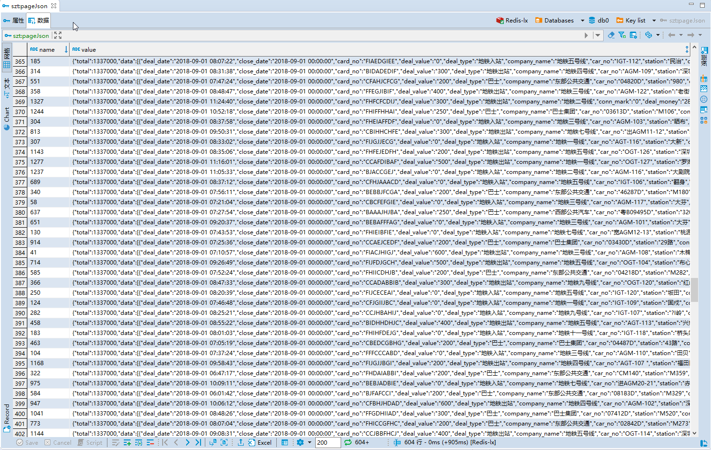
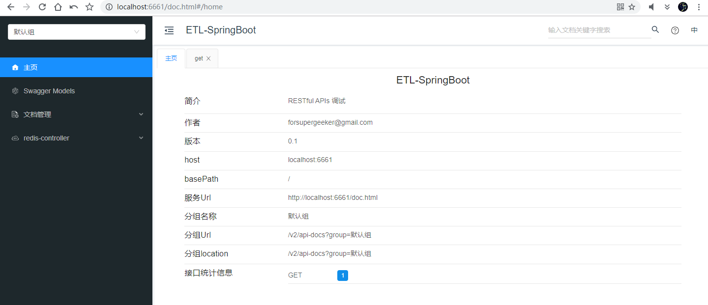
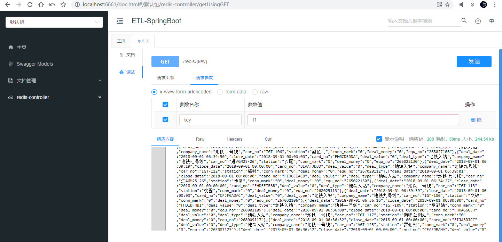
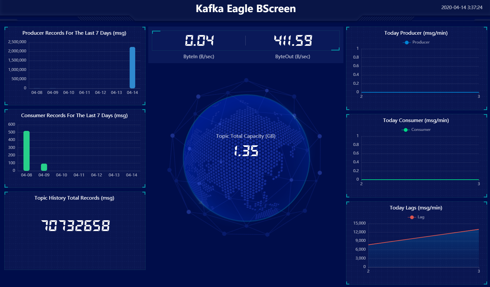
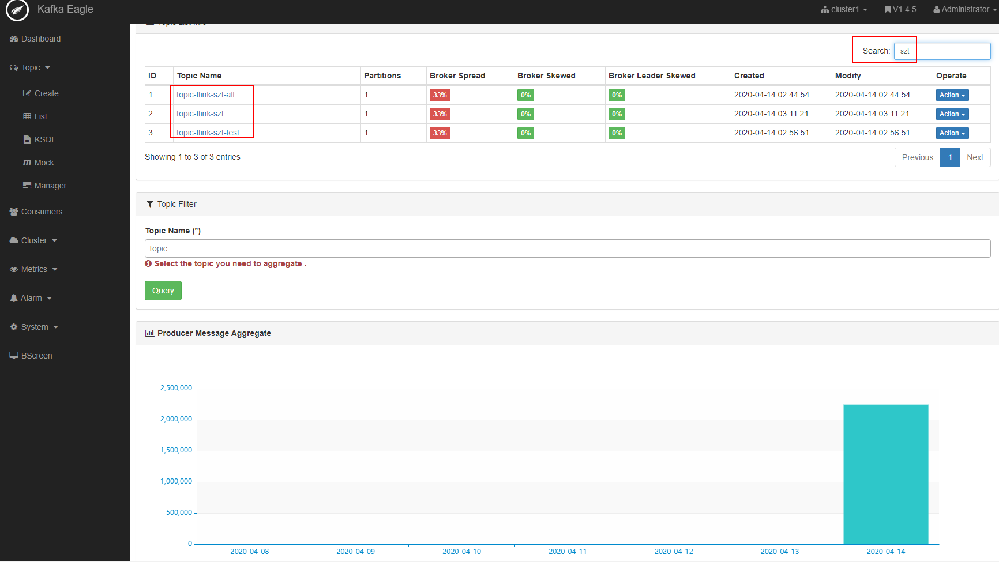
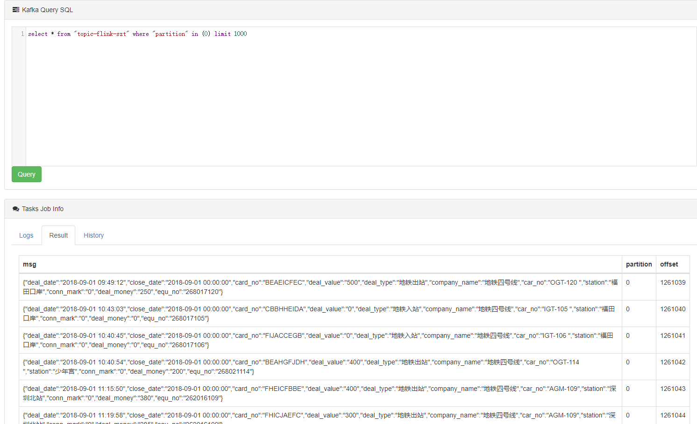
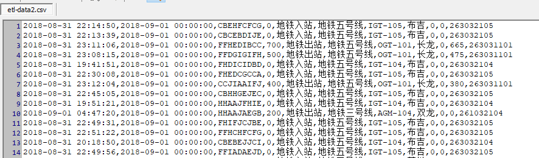

# SZT-bigdata 深圳地铁大数据客流分析系统 🚇🚇🚇

```
   ___     ____   _____           _         _      __ _      _             _
  / __|   |_  /  |_   _|   ___   | |__     (_)    / _` |  __| |   __ _    | |_    __ _
  \__ \    / /     | |    |___|  | '_ \    | |    \__, | / _` |  / _` |   |  _|  / _` |
  |___/   /___|   _|_|_   _____  |_.__/   _|_|_   |___/  \__,_|  \__,_|   _\__|  \__,_|
_|"""""|_|"""""|_|"""""|_|     |_|"""""|_|"""""|_|"""""|_|"""""|_|"""""|_|"""""|_|"""""|
"`-0-0-'"`-0-0-'"`-0-0-'"`-0-0-'"`-0-0-'"`-0-0-'"`-0-0-'"`-0-0-'"`-0-0-'"`-0-0-'"`-0-0-'
```

## 项目说明🚩：
- 🎈该项目主要分析深圳通刷卡数据，通过大数据技术角度来研究深圳地铁客运能力。
- ✨🎉 强调学以致用，本项目的原则是尽可能使用较多的常用技术框架，加深对各技术栈的理解和运用，在使用过程中体验各框架的差异和优劣，为以后的开发项目选型做基础。
- 👑 解决同一个问题，可能有多种技术实现；实际的企业开发应当遵守最佳实践原则。


## 数据源🌍：
- 深圳市政府数据开放平台，深圳通刷卡数据 133.7 万条【离线数据】，
https://opendata.sz.gov.cn/data/api/toApiDetails/29200_00403601
    
理论上可以当作实时数据，但是这个接口响应太慢了，于是本项目采用离线思路处理。当然，如果采用 kafka 队列方式，也可以模拟出实时效果。
    
## 核心技术栈⚡：
- Java/Scala
- Flink-1.10
- Redis-3.2
- SpringBoot-2.13
- knife4j-2.0 （前身为 swagger-bootstrap-ui）
- kafka-0.11 (最佳 CP kafka-eagle)
- CDH-6.2


## 快速开始🛩🥇：
1- 获取数据源的 appKey：https://opendata.sz.gov.cn/data/api/toApiDetails/29200_00403601

2- 调用 ETL-SpringBoot 模块获取原始数据存盘`2018record.jsons`，`cn/java666/etlspringboot/source/SZTData.saveData()`；

3- 调用 ETL-Flink 模块，实现 etl 清洗，去除重复数据，redis 天然去重排序，保证数据干净有序，`cn.java666.etlflink.sink.RedisSinkPageJson.main()`。

4- redis 查询，redis-cli 登录:  
`> hget szt:pageJson 1`  

或者 dbeaver 可视化查询：


5- `cn.java666.etlspringboot.EtlSApp.main()` 启动后，也可以用 knife4j 在线调试 REST API：
   

   

6- `cn.java666.etlflink.source.MyRedisSourceFun.run()` 清洗数据发现 133.7 万数据中，有小部分元数据字段数为9，缺少两个字段：station、car_no；丢弃脏数据。

合格元数据示例：
```json
{
    "deal_date": "2018-08-31 21:15:55",
    "close_date": "2018-09-01 00:00:00",
    "card_no": "CBHGDEEJB",
    "deal_value": "0",
    "deal_type": "地铁入站",
    "company_name": "地铁五号线",
    "car_no": "IGT-104",
    "station": "布吉",
    "conn_mark": "0",
    "deal_money": "0",
    "equ_no": "263032104"
}
```
不合格的元数据示例：
```json
{
    "deal_date": "2018-09-01 05:24:22",
    "close_date": "2018-09-01 00:00:00",
    "card_no": "HHAAABGEH",
    "deal_value": "0",
    "deal_type": "地铁入站",
    "company_name": "地铁一号线",
    "conn_mark": "0",
    "deal_money": "0",
    "equ_no": "268005140"
}
```
7- 根据需求推送满足业务要求的元数据到 kafka：`cn.java666.etlflink.app.Redis2Kafka.main()`；`topic-flink-szt-all`保留了所有元数据 1337000 条， `topic-flink-szt` 仅包含清洗合格的元数据 1266039 条。

8- kafka-eagle 监控查看 topic：



ksql 命令：  
`select * from "topic-flink-szt" where "partition" in (0) limit 1000`



9- `cn.java666.etlflink.app.Redis2Csv.main()` 实现了 flink sink csv 格式文件。


10- ...


## TODO🔔🔔🔔:
- [x] 解析 redis pageJson，转换数据格式为最小数据单元存到 csv，减少原始数据的冗余字符，方便存取和传输。丰富数据源的格式，兼容更多的实现方案； 
- [x] 推送 kafka，使用队列传输数据；
- [ ] 存入 elasticsearch，使用全文检索实现实时搜索，kibana 可视化展示； 


## 更新日志🌥：
- 2020-04-14
    - 重构
    - 完成 csv 格式文件的抽取；
    
- 2020-04-13 
    - 项目初始化；
    - 完成数据源清洗去重，存到 redis；
    - 完成 redis 查询 REST API 的开发；
    - 完成 flink 自定义 source redis 的开发，并且更细粒度清洗元数据；
    - 完成 推送元数据到 kafka；

    