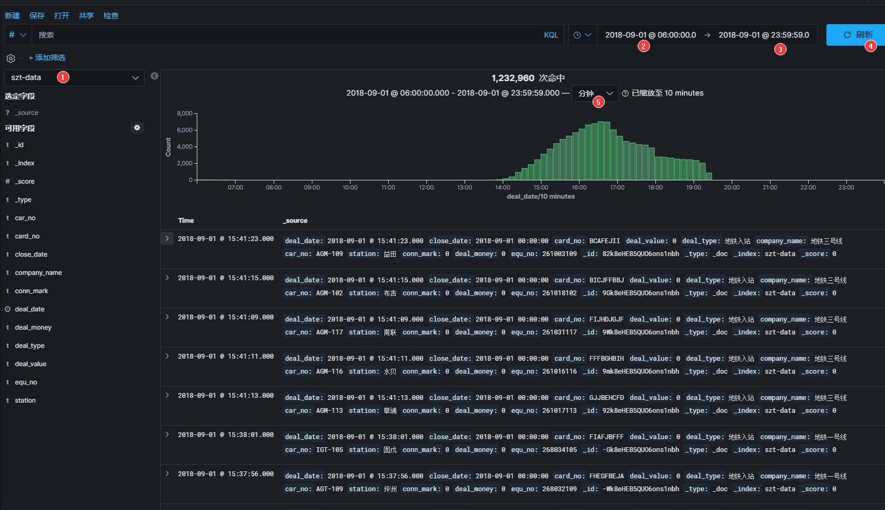

# SZT-bigdata 深圳地铁大数据客流分析系统 🚇🚇🚇

<p align="center">


</p>


```
   ___     ____   _____           _         _      __ _      _             _
  / __|   |_  /  |_   _|   ___   | |__     (_)    / _` |  __| |   __ _    | |_    __ _
  \__ \    / /     | |    |___|  | '_ \    | |    \__, | / _` |  / _` |   |  _|  / _` |
  |___/   /___|   _|_|_   _____  |_.__/   _|_|_   |___/  \__,_|  \__,_|   _\__|  \__,_|
_|"""""|_|"""""|_|"""""|_|     |_|"""""|_|"""""|_|"""""|_|"""""|_|"""""|_|"""""|_|"""""|
"`-0-0-'"`-0-0-'"`-0-0-'"`-0-0-'"`-0-0-'"`-0-0-'"`-0-0-'"`-0-0-'"`-0-0-'"`-0-0-'"`-0-0-'
```
---

## 项目说明🚩：
- 🎈该项目主要分析深圳通刷卡数据，通过大数据技术角度来研究深圳地铁客运能力；
- ✨🎉 强调学以致用，本项目的原则是尽可能使用较多的常用技术框架，加深对各技术栈的理解和运用，在使用过程中体验各框架的差异和优劣，为以后的开发项目选型做基础；
- 👑 解决同一个问题，可能有多种技术实现；实际的企业开发应当遵守最佳实践原则；
- 学习过程优先选择较新的软件版本，因为新版踩坑一定比老版更多，坑踩的多了，技能也就提高了；

---

## 数据源🌍：
- 深圳市政府数据开放平台，深圳通刷卡数据 133.7 万条【离线数据】，
https://opendata.sz.gov.cn/data/api/toApiDetails/29200_00403601
    
理论上可以当作实时数据，但是这个接口响应太慢了，于是本项目采用离线思路处理。当然，如果采用 kafka 队列方式，也可以模拟出实时效果。

---
    
## 核心技术栈(持续更新)⚡：
- Java/Scala  


- Flink-1.10  


- Redis-3.2  


- SpringBoot-2.13  


- knife4j-2.0 （前身为 swagger-bootstrap-ui）  


- kafka-0.11 (最佳 CP kafka-eagle)  


- CDH-6.2  


- Docker  


- Elasticsearch-7  


- Spark-2.3  


- Hive-2.1  


- Impala  


- HBase  

- ...

---

## 快速开始🛩🥇：
> 前提是你得具备java、scala、大数据开发常用的环境，要不然快不起来😂😂😂，比如 IDEA、DBeaver、CDH等

1- 获取数据源的 appKey：https://opendata.sz.gov.cn/data/api/toApiDetails/29200_00403601

2- 调用 ETL-SpringBoot 模块获取原始数据存盘`2018record.jsons`，`cn/java666/etlspringboot/source/SZTData.saveData()`；

3- 调用 ETL-Flink 模块，实现 etl 清洗，去除重复数据，redis 天然去重排序，保证数据干净有序，`cn.java666.etlflink.sink.RedisSinkPageJson.main()`。

4- redis 查询，redis-cli 登录:  
`> hget szt:pageJson 1`  

或者 dbeaver 可视化查询：


5- `cn.java666.etlspringboot.EtlSApp.main()` 启动后，也可以用 knife4j 在线调试 REST API：

   

   

6- `cn.java666.etlflink.source.MyRedisSourceFun.run()` 清洗数据发现 133.7 万数据中，有小部分源数据字段数为9，缺少两个字段：station、car_no；丢弃脏数据。

合格源数据示例：
```json
{
    "deal_date": "2018-08-31 21:15:55",
    "close_date": "2018-09-01 00:00:00",
    "card_no": "CBHGDEEJB",
    "deal_value": "0",
    "deal_type": "地铁入站",
    "company_name": "地铁五号线",
    "car_no": "IGT-104",
    "station": "布吉",
    "conn_mark": "0",
    "deal_money": "0",
    "equ_no": "263032104"
}
```
不合格的源数据示例：
```json
{
    "deal_date": "2018-09-01 05:24:22",
    "close_date": "2018-09-01 00:00:00",
    "card_no": "HHAAABGEH",
    "deal_value": "0",
    "deal_type": "地铁入站",
    "company_name": "地铁一号线",
    "conn_mark": "0",
    "deal_money": "0",
    "equ_no": "268005140"
}
```
7- 根据需求推送满足业务要求的源数据到 kafka：`cn.java666.etlflink.app.Redis2Kafka.main()`；`topic-flink-szt-all`保留了所有源数据 1337000 条， `topic-flink-szt` 仅包含清洗合格的源数据 1266039 条。

8- kafka-eagle 监控查看 topic：


ksql 命令：  
`select * from "topic-flink-szt" where "partition" in (0) limit 1000`


9- `cn.java666.etlflink.app.Redis2Csv.main()` 实现了 flink sink csv 格式文件。


10- `cn.java666.etlflink.sink.MyESSinkFun()`  
`cn.java666.etlflink.app.Redis2ES.main`  

实现了 ES 存储源数据，实时全文检索，实时跟踪深圳通刷卡数据；  
这个模块涉及技术细节比较多，如果没有 ES 使用经验，可以先做下功课，不然的话会很懵，实在看不明白的话，将就照做就可以，只不过会有很多瑕疵；     
我当时在处理 ES 各种问题踩了不少坑，熬了不少通宵，掉了很多头发。    
**遇到问题心态要稳，因为你今天处理了一个问题，明天接触新的版本新的框架大概率又会出现新的问题**。。🥺🥺🥺   
所以最佳实践很重要！！！  

🎬🎬🎬接下来，让我们时光倒流，回到 2018-09-01这一天，调整 kibana 面板时间范围 [2018-09-01 06:00:00]-[2019-09-01 23:59:59]，看看当天深圳通刷卡记录的统计图曲线走向是否科学，间接验证数据源的完整性。 
  

图中可以看出 2018-09-01 这一天刷卡记录集中在下午15点~下午19点之间，但是早高峰数据完全对不上。  
回顾一下本项目 ETL 处理流程：
> 1337000 条源数据清洗去除字段不全的脏数据，剩余的合格数据条数 1266039 已经进入 ES 索引 `szt-data`  

> 在 1266039 条合格数据中，有 1232960 条数据集中在 2018-09-01 这一天的下午时段；  

> 我们暂且相信下午时段的数据是真实的，那么是否说明官方提供的数据并不是全部的当天完整刷卡数据？？？；   

> 如果按照下午的刷卡量来估测全天的刷卡量，那么深圳通全天的刷卡记录数据应该在 123万 X 2 左右，当然这么武断的判断方式不是程序员的风格，接下来我们用科学的大数据分析方式来研究这些数据背后的意义。


注意，新手必坑：  
- ES 存数据时，带有时间字段的数据如何实时展示到 kibana 的图表面板上？  
🤣需要在存入 index 之前设置字段映射。参考格式，不要照抄！！！  
```json
{
  "properties": {
    "deal_date": {
      "format": "yyyy-MM-dd HH:mm:ss",
      "type": "date"
    }
  }
}  
```

- ES 存数据时，需要使用 json 格式包装数据，不符合json 语法的纯字符无法保存；  
- ES 序列化复杂的 bean 对象时，如果 fastjson 报错，推荐使用 Gson，很强！  

### tips😙😙😙：
- Gson 相比 fastjson：Gson 序列化能力更强，但是 反序列化时，fastjson 速度更快。

11- ...

---

## TODO🔔🔔🔔:
- [x] 解析 redis pageJson，转换数据格式为最小数据单元存到 csv，减少原始数据的冗余字符，方便存取和传输。丰富数据源的格式，兼容更多的实现方案； 
- [x] 推送 kafka，使用队列传输数据；
- [x] 存入 elasticsearch，使用全文检索实现实时搜索，kibana 可视化展示； 
- [ ] 数仓建模：ODS、DWD、DWS、ADS
- [ ] hive 分析，oozie 调度；    
- [ ] flink 流式实时分析早晚高峰站点压力排行；  
- [ ] spark 微批处理。。。
- [ ] DataX 可视化大屏展示；  

---

## 更新日志🌥：
- 2020-04-14
    - 重构；
    - 完成 csv 格式文件的抽取；
    - 添加 GPL-3 开源证书，鼓励开源分发；
    - 添加徽标； 
    - 完成写入 ES 数据库，添加时间映射,kibana 实时查看刷卡数据统计曲线的变化；
    
- 2020-04-13 
    - 项目初始化；
    - 完成数据源清洗去重，存到 redis；
    - 完成 redis 查询 REST API 的开发；
    - 完成 flink 自定义 source redis 的开发，并且更细粒度清洗源数据；
    - 完成 推送源数据到 kafka；

    
## 联系😪：
欢迎交流技术      


